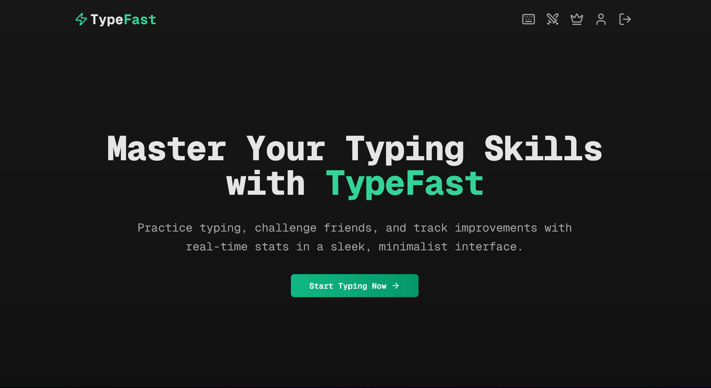

# ⚡ TypeFast ⌨️🚀

🧠 **TypeFast** is a modern, minimalist **typing speed test application** built using **Next.js**.  
It helps users **practice typing**, **measure speed & accuracy**, and **compete with others** in a clean, distraction-free environment ✨.

This README is written in a **beginner-friendly** way so that anyone can understand the project and build it from scratch 🛠️🙂.

---

## 🧠 What Is TypeFast? 🤔

TypeFast allows users to:
- Test typing speed (**Words Per Minute**) ⏱️  
- Measure typing accuracy 🎯  
- Compete with friends in real-time typing races 🏁  
- View **global** and **daily** leaderboards 🌍  
- Track detailed typing statistics over time 📊  

The main goal of this project is to provide a **fast ⚡, smooth 🧈, and minimal 🧘 experience**.

---

## 🎯 Who Should Use or Build This Project?

- 🐣 Beginners learning Next.js and full-stack development  
- 🎓 Students building portfolio or college projects  
- 🧑‍💻 Developers practicing real-world app architecture  
- ⌨️ Anyone interested in typing speed applications  
- 💼 Interview and demo-ready projects  

---

## 🚀 Features

### ⌨️ Typing Test
- Real-time WPM calculation ⚡  
- Live accuracy tracking 🎯  
- Instant feedback while typing 👀  

### 🏁 Challenges & Multiplayer
- Challenge friends in typing races 🤝  
- Real-time competition 🕒  
- Fair and synchronized typing tests ⚖️  

### 🏆 Leaderboards
- Global leaderboard 🌍  
- Daily rankings reset automatically 🔁  
- Compare performance with other users 📈  

### 📊 Statistics & Progress
- Detailed typing statistics 🧮  
- Track improvement over time 📅  
- Speed vs accuracy insights 🔍  

### 🎨 UI & Experience
- Clean and minimalist interface ✨  
- Smooth animations 🎞️  
- Fully responsive design 📱💻  

---

## 🛠 Tech Stack (Simple Explanation)

### 🌐 Frontend
- **Next.js** – React framework for building fast web apps  
- **TypeScript** – Adds type safety and reduces bugs  
- **Tailwind CSS** – Utility-first CSS framework  
- **Shadcn UI** – Modern UI components  
- **Framer Motion** – Animations  

### 🧠 State & Authentication
- **Zustand** – Lightweight state management  
- **Auth.js** – Authentication and session handling  

### 🗄 Backend & Database
- **PostgreSQL** – Relational database  
- **Prisma** – ORM for database access  
- **Redis (ioredis)** – Caching and real-time features  
- **Resend** – Email service 📧  

---

## 📁 Project Structure (High-Level)

TypeFast  
apps  
web – Next.js frontend  
packages  
db – Database and Prisma setup  
prisma – Database schema  
README.md  

This structure helps keep frontend and database logic **clean, modular, and scalable** 🧩.

---

## 🔄 How the App Works (Step-by-Step)

1️⃣ User opens the application 🌐  
2️⃣ User logs in or signs up 🔐  
3️⃣ Typing test starts ⌨️  
4️⃣ App tracks keystrokes in real time ⚡  
5️⃣ Speed and accuracy are calculated instantly 🧮  
6️⃣ Results are stored in the database 💾  
7️⃣ Leaderboards and statistics are updated 🏆  

---

## 📋 Prerequisites

Before starting, make sure you have:
- Node.js (v18 or higher) 🟢  
- Yarn package manager 🧶  
- PostgreSQL database 🐘  
- Redis (local or cloud) ⚡  

---

## 🚀 Getting Started

### Step 1: Clone the Repository 📥
git clone https://github.com/Kshitiz2431/SwiftKeys-.git  
cd TypeFast-  

### Step 2: Install Dependencies 📦
yarn  

### Step 3: Setup Environment Variables 🔐
Copy the example environment files:
- apps/web/.env.example → apps/web/.env  
- packages/db/.env.example → packages/db/.env  

Fill in required values such as:
- Database URL  
- Authentication secrets  
- Redis URL  
- Email API keys  

### Step 4: Setup Database 🗄
yarn db:setup  

This command will:
- Initialize the database  
- Run Prisma migrations  

### Step 5: Start Development Server ▶️
yarn dev  

### Step 6: Open in Browser 🌐
Open http://localhost:3000 in your browser.

---

## 🧪 Common Issues & Fixes

❌ Typing not registering  
✔️ Check keyboard focus and browser permissions  

❌ Database connection error  
✔️ Verify database URL in environment variables  

❌ Authentication not working  
✔️ Ensure Auth.js secrets are correctly set  

---

## 🚀 Future Improvements

- 💬 Multiplayer chat during races  
- 🧑‍💻 More typing modes (code typing, quotes)  
- 🏅 User profiles and achievements  
- 🌗 Dark and light theme toggle  
- 📱 Better mobile experience  

---

## 🤝 Contributing

Contributions are welcome 🙌  

Steps:
1. Fork the repository 🍴  
2. Create a new feature branch 🌿  
3. Make your changes ✏️  
4. Commit and push ⬆️  
5. Open a Pull Request 🔁  

---

## 📝 License

This project is licensed under the **MIT License** 📄.

---

## 🎉 Final Note

TypeFast is a **real-world, production-style project** that is:
- Beginner friendly 🐣  
- Resume ready 📄  
- Interview ready 💼  
- Easy to extend 🧩  

Happy typing ⚡⌨️🚀
